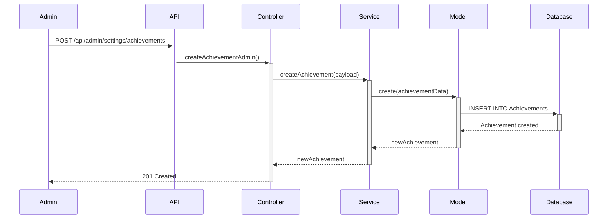
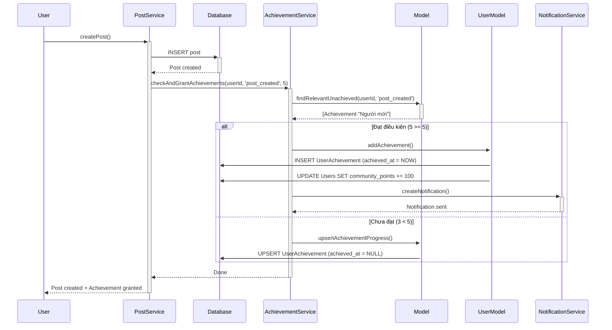
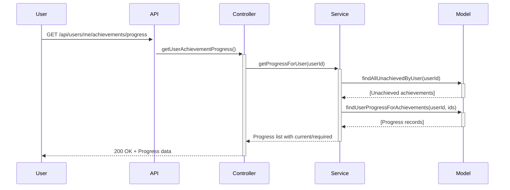

# 🏆 HỆ THỐNG THÀNH TÍCH (ACHIEVEMENT SYSTEM)

## 📋 Mục lục
- [Tổng quan](#tổng-quan)
- [Kiến trúc hệ thống](#kiến-trúc-hệ-thống)
- [Luồng hoạt động](#luồng-hoạt-động)
- [API Documentation](#api-documentation)
- [Cấu trúc dữ liệu](#cấu-trúc-dữ-liệu)
- [Ví dụ sử dụng](#ví-dụ-sử-dụng)

---

## Tổng quan

Hệ thống thành tích cho phép:
- **Admin**: Tạo, quản lý các thành tích với điều kiện đạt được
- **User**: Tự động nhận thành tích khi đạt điều kiện, theo dõi tiến độ
- **Tự động hóa**: Hệ thống tự động kiểm tra và trao thưởng khi user đạt điều kiện

### Tính năng chính
✅ Tạo thành tích với criteria linh hoạt (post_created, likes_received, login_streak...)  
✅ Tự động theo dõi tiến độ và trao thưởng  
✅ Gửi thông báo realtime khi đạt thành tích  
✅ Cộng điểm community_points tự động  
✅ Thống kê và báo cáo chi tiết  
✅ Phân trang, tìm kiếm, lọc cho admin  

---

## Kiến trúc hệ thống

### Cấu trúc thư mục
```
├── routes/
│   └── achievementRoutes.js      # Định nghĩa các API endpoints
├── controllers/
│   └── achievementController.js  # Xử lý request/response
├── services/
│   └── achievementService.js     # Business logic
└── models/
    └── achievementModel.js       # Database queries
```

### Database Schema

#### Bảng `Achievements`
```sql
CREATE TABLE "Achievements" (
  id UUID PRIMARY KEY DEFAULT uuid_generate_v4(),
  name VARCHAR(255) UNIQUE NOT NULL,
  description TEXT,
  criteria JSONB NOT NULL,           -- { type: 'post_created', value: 10 }
  icon VARCHAR(50),
  points INTEGER DEFAULT 0,
  is_active BOOLEAN DEFAULT true,
  created_at TIMESTAMP DEFAULT NOW(),
  updated_at TIMESTAMP DEFAULT NOW()
);
```

#### Bảng `UserAchievements`
```sql
CREATE TABLE "UserAchievements" (
  id UUID PRIMARY KEY DEFAULT uuid_generate_v4(),
  user_id UUID REFERENCES "Users"(id) ON DELETE CASCADE,
  achievement_id UUID REFERENCES "Achievements"(id) ON DELETE CASCADE,
  progress JSONB,                    -- { current: 3, required: 5 }
  achieved_at TIMESTAMP,             -- NULL = chưa đạt, NOT NULL = đã đạt
  created_at TIMESTAMP DEFAULT NOW(),
  UNIQUE(user_id, achievement_id)
);
```

### Criteria Types (Loại điều kiện)

| Type | Mô tả | Ví dụ |
|------|-------|-------|
| `post_created` | Số bài viết đã tạo | `{ type: 'post_created', value: 10 }` |
| `post_likes_received` | Số lượt like nhận được | `{ type: 'post_likes_received', value: 50 }` |
| `login_streak` | Số ngày đăng nhập liên tiếp | `{ type: 'login_streak', value: 7 }` |
| `comment_count` | Số bình luận đã tạo | `{ type: 'comment_count', value: 100 }` |
| `follower_count` | Số người theo dõi | `{ type: 'follower_count', value: 20 }` |

---

## Luồng hoạt động

### 1️⃣ Admin tạo thành tích



**Request:**
```json
POST /api/admin/settings/achievements
{
  "name": "Người mới",
  "description": "Tạo 5 bài viết đầu tiên",
  "criteria": {
    "type": "post_created",
    "value": 5
  },
  "icon": "🎉",
  "points": 100,
  "is_active": true
}
```

### 2️⃣ User thực hiện hành động → Tự động kiểm tra thành tích



### 3️⃣ User xem tiến độ



---

## API Documentation

### 🌐 PUBLIC APIs (Không cần authentication)

#### 1. Lấy danh sách thành tích công khai
```http
GET /api/achievements
```

**Response:**
```json
{
  "success": true,
  "data": [
    {
      "id": "uuid",
      "name": "Người mới",
      "description": "Tạo 5 bài viết đầu tiên",
      "icon": "🎉",
      "points": 100,
      "criteria": {
        "type": "post_created",
        "value": 5
      },
      "is_active": true,
      "created_at": "2024-01-01T00:00:00Z"
    }
  ]
}
```

#### 2. Lấy chi tiết 1 thành tích
```http
GET /api/achievements/:id
```

**Response:**
```json
{
  "success": true,
  "data": {
    "id": "uuid",
    "name": "Người mới",
    "description": "Tạo 5 bài viết đầu tiên",
    "icon": "🎉",
    "points": 100,
    "criteria": {
      "type": "post_created",
      "value": 5
    }
  }
}
```

#### 3. Xem thành tích của user khác
```http
GET /api/users/:userId/achievements
```

**Response:**
```json
{
  "success": true,
  "data": [
    {
      "id": "uuid",
      "name": "Người mới",
      "icon": "🎉",
      "points": 100,
      "achieved_at": "2024-01-15T10:30:00Z",
      "progress": {
        "current": 5,
        "required": 5
      }
    }
  ]
}
```

---

### 👤 USER APIs (Cần authentication)

#### 4. Lấy thành tích đã đạt được
```http
GET /api/users/me/achievements
Authorization: Bearer <token>
```

**Response:**
```json
{
  "success": true,
  "data": [
    {
      "id": "uuid",
      "name": "Người mới",
      "description": "Tạo 5 bài viết đầu tiên",
      "icon": "🎉",
      "points": 100,
      "achieved_at": "2024-01-15T10:30:00Z",
      "progress": {
        "current": 5,
        "required": 5
      }
    }
  ]
}
```

#### 5. Lấy tiến độ thành tích chưa hoàn thành
```http
GET /api/users/me/achievements/progress
Authorization: Bearer <token>
```

**Response:**
```json
{
  "success": true,
  "data": [
    {
      "id": "uuid",
      "name": "Chuyên gia",
      "description": "Tạo 50 bài viết",
      "icon": "⭐",
      "points": 500,
      "criteria": {
        "type": "post_created",
        "value": 50
      },
      "progress": {
        "current": 23
      }
    }
  ]
}
```

#### 6. Lấy thống kê thành tích
```http
GET /api/users/me/achievements/statistics
Authorization: Bearer <token>
```

**Response:**
```json
{
  "success": true,
  "data": {
    "total_achievements": 15,
    "achieved_count": 5,
    "unachieved_count": 10,
    "total_points": 750,
    "completion_rate": 33.33,
    "recent_achievements": [
      {
        "id": "uuid",
        "name": "Người mới",
        "icon": "🎉",
        "points": 100,
        "achieved_at": "2024-01-15T10:30:00Z"
      }
    ]
  }
}
```

#### 7. Lấy thành tích sắp đạt được
```http
GET /api/users/me/achievements/almost-achieved?threshold=0.7
Authorization: Bearer <token>
```

**Query Parameters:**
- `threshold` (optional): Ngưỡng % tiến độ (mặc định 0.7 = 70%)

**Response:**
```json
{
  "success": true,
  "data": [
    {
      "id": "uuid",
      "name": "Chuyên gia",
      "description": "Tạo 50 bài viết",
      "icon": "⭐",
      "points": 500,
      "criteria": {
        "type": "post_created",
        "value": 50
      },
      "progress": {
        "current": 45
      }
    }
  ]
}
```

---

### 🔐 ADMIN APIs (Cần authentication + admin role)

#### 8. Lấy danh sách thành tích (Admin)
```http
GET /api/admin/settings/achievements?page=1&limit=10&search=&status=all&sortBy=created_at&sortOrder=desc
Authorization: Bearer <admin_token>
```

**Query Parameters:**
- `page` (default: 1): Trang hiện tại
- `limit` (default: 10): Số item mỗi trang
- `search` (optional): Tìm kiếm theo name/description
- `status` (optional): `all` | `active` | `inactive`
- `sortBy` (optional): `created_at` | `points` | `name`
- `sortOrder` (optional): `asc` | `desc`

**Response:**
```json
{
  "success": true,
  "message": "Lấy danh sách thành tích thành công.",
  "data": [
    {
      "id": "uuid",
      "name": "Người mới",
      "description": "Tạo 5 bài viết đầu tiên",
      "criteria": {
        "type": "post_created",
        "value": 5
      },
      "icon": "🎉",
      "points": 100,
      "is_active": true,
      "created_at": "2024-01-01T00:00:00Z"
    }
  ],
  "meta": {
    "page": 1,
    "limit": 10,
    "total": 25,
    "totalPages": 3
  }
}
```

#### 9. Tạo thành tích mới
```http
POST /api/admin/settings/achievements
Authorization: Bearer <admin_token>
Content-Type: application/json
```

**Request Body:**
```json
{
  "name": "Người mới",
  "description": "Tạo 5 bài viết đầu tiên",
  "criteria": {
    "type": "post_created",
    "value": 5
  },
  "icon": "🎉",
  "points": 100,
  "is_active": true
}
```

**Response:**
```json
{
  "success": true,
  "message": "Tạo thành tích thành công.",
  "data": {
    "id": "uuid",
    "name": "Người mới",
    "description": "Tạo 5 bài viết đầu tiên",
    "criteria": {
      "type": "post_created",
      "value": 5
    },
    "icon": "🎉",
    "points": 100,
    "is_active": true,
    "created_at": "2024-01-01T00:00:00Z"
  }
}
```

**Error Responses:**
```json
// 400 Bad Request - Thiếu trường bắt buộc
{
  "success": false,
  "message": "Các trường 'name', 'description', và 'criteria' là bắt buộc."
}

// 409 Conflict - Tên trùng lặp
{
  "success": false,
  "message": "Tên thành tích 'Người mới' đã tồn tại."
}
```

#### 10. Lấy thống kê tổng quan (Admin Dashboard)
```http
GET /api/admin/achievements/statistics
Authorization: Bearer <admin_token>
```

**Response:**
```json
{
  "success": true,
  "data": {
    "total_achievements": 25,
    "active_achievements": 20,
    "total_users_with_achievements": 1500,
    "total_achievements_granted": 5000,
    "total_points_distributed": 250000,
    "most_popular_achievements": [
      {
        "id": "uuid",
        "name": "Người mới",
        "icon": "🎉",
        "user_count": 1200
      }
    ]
  }
}
```

#### 11. Cập nhật thông tin thành tích
```http
PUT /api/admin/settings/achievements/:id
Authorization: Bearer <admin_token>
Content-Type: application/json
```

**Request Body:**
```json
{
  "name": "Người mới (Updated)",
  "description": "Mô tả mới",
  "points": 150
}
```

**Response:**
```json
{
  "success": true,
  "message": "Cập nhật thành tích thành công.",
  "data": {
    "id": "uuid",
    "name": "Người mới (Updated)",
    "description": "Mô tả mới",
    "points": 150,
    "updated_at": "2024-01-20T10:00:00Z"
  }
}
```

#### 12. Kích hoạt/Vô hiệu hóa thành tích
```http
PATCH /api/admin/settings/achievements/:id/status
Authorization: Bearer <admin_token>
Content-Type: application/json
```

**Request Body:**
```json
{
  "is_active": false
}
```

**Response:**
```json
{
  "success": true,
  "message": "Thành tích đã được vô hiệu hóa.",
  "data": {
    "id": "uuid",
    "name": "Người mới",
    "is_active": false
  }
}
```

#### 13. Xóa thành tích
```http
DELETE /api/admin/settings/achievements/:id
Authorization: Bearer <admin_token>
```

**Response:**
```json
{
  "success": true,
  "message": "thành công"
}
```

**Note:** Xóa thành tích sẽ tự động xóa tất cả bản ghi UserAchievements liên quan (CASCADE).

#### 14. Lấy danh sách user đã đạt thành tích
```http
GET /api/admin/settings/achievements/:achievementId/users?page=1&limit=10
Authorization: Bearer <admin_token>
```

**Response:**
```json
{
  "success": true,
  "message": "Lấy danh sách người dùng thành công.",
  "data": {
    "data": [
      {
        "id": "uuid",
        "user_id": "user-uuid",
        "user_name": "Nguyễn Văn A",
        "user_avatar": "https://...",
        "achievement_id": "achievement-uuid",
        "achievement_name": "Người mới",
        "achieved_at": "2024-01-15T10:30:00Z",
        "progress": {
          "current": 5,
          "required": 5
        }
      }
    ],
    "meta": {
      "page": 1,
      "limit": 10,
      "total": 1200,
      "totalPages": 120
    }
  }
}
```

#### 15. Cập nhật tiến độ thủ công
```http
POST /api/admin/achievements/progress
Authorization: Bearer <admin_token>
Content-Type: application/json
```

**Request Body:**
```json
{
  "userId": "user-uuid",
  "criteriaType": "post_created",
  "value": 2
}
```

**Cách hoạt động:**
- Hệ thống sẽ **cộng dồn** giá trị: `currentProgress + value`
- Ví dụ: User đang có 3 posts, admin thêm 2 → Tổng = 5
- Nếu đạt điều kiện (5 >= 5) → Tự động grant achievement

**Response:**
```json
{
  "success": true,
  "message": "Cập nhật tiến độ thành tích thành công.",
  "data": {
    "newlyAchieved": ["achievement-uuid-1"],
    "updatedProgress": ["achievement-uuid-2"]
  }
}
```

---

## Cấu trúc dữ liệu

### Achievement Object
```typescript
interface Achievement {
  id: string;
  name: string;
  description: string;
  criteria: {
    type: 'post_created' | 'post_likes_received' | 'login_streak' | string;
    value: number;
  };
  icon: string;
  points: number;
  is_active: boolean;
  created_at: string;
  updated_at: string;
}
```

### UserAchievement Object
```typescript
interface UserAchievement {
  id: string;
  user_id: string;
  achievement_id: string;
  progress: {
    current: number;
    required?: number;
  };
  achieved_at: string | null; // null = chưa đạt, có giá trị = đã đạt
  created_at: string;
}
```

---

## Ví dụ sử dụng

### Ví dụ 1: Tích hợp vào PostService

```javascript
// services/postService.js

const createPost = async (userId, postData) => {
  // 1. Tạo bài viết
  const newPost = await postModel.create(userId, postData);
  
  // 2. Lấy tổng số bài viết của user
  const totalPosts = await postModel.countByUserId(userId);
  
  // 3. Kiểm tra và trao thành tích
  await achievementService.checkAndGrantAchievements(
    userId,
    'post_created',
    totalPosts
  );
  
  return newPost;
};
```

### Ví dụ 2: Tích hợp vào LikeService

```javascript
// services/likeService.js

const likePost = async (userId, postId) => {
  // 1. Thêm like
  await likeModel.create(userId, postId);
  
  // 2. Lấy tổng số like mà tác giả bài viết nhận được
  const post = await postModel.findById(postId);
  const totalLikes = await likeModel.countByAuthorId(post.author_id);
  
  // 3. Kiểm tra thành tích cho tác giả
  await achievementService.checkAndGrantAchievements(
    post.author_id,
    'post_likes_received',
    totalLikes
  );
};
```

### Ví dụ 3: Tích hợp vào LoginService

```javascript
// services/authService.js

const login = async (email, password) => {
  // 1. Xác thực user
  const user = await userModel.findByEmail(email);
  
  // 2. Cập nhật login streak
  const streak = await userModel.updateLoginStreak(user.id);
  
  // 3. Kiểm tra thành tích login streak
  await achievementService.checkAndGrantAchievements(
    user.id,
    'login_streak',
    streak
  );
  
  return generateToken(user);
};
```

### Ví dụ 4: Hiển thị progress bar trên Frontend

```javascript
// Frontend React Component

const AchievementProgress = ({ achievement, progress }) => {
  const percentage = (progress.current / achievement.criteria.value) * 100;
  
  return (
    <div className="achievement-card">
      <div className="icon">{achievement.icon}</div>
      <h3>{achievement.name}</h3>
      <p>{achievement.description}</p>
      
      <div className="progress-bar">
        <div 
          className="progress-fill" 
          style={{ width: `${percentage}%` }}
        />
      </div>
      
      <span className="progress-text">
        {progress.current} / {achievement.criteria.value}
      </span>
      
      <span className="points">+{achievement.points} điểm</span>
    </div>
  );
};
```

---

## Best Practices

### 1. Khi nào gọi `checkAndGrantAchievements()`?

✅ **NÊN gọi:**
- Sau khi tạo/xóa bài viết
- Sau khi nhận/mất like
- Sau khi login thành công
- Sau khi hoàn thành hành động quan trọng

❌ **KHÔNG NÊN gọi:**
- Trong vòng lặp lớn
- Trong transaction đang chạy (có thể gây deadlock)
- Khi chỉ đọc dữ liệu

### 2. Performance Tips

```javascript
// ❌ BAD: Gọi nhiều lần trong vòng lặp
for (const post of posts) {
  await achievementService.checkAndGrantAchievements(userId, 'post_created', i);
}

// ✅ GOOD: Gọi 1 lần với giá trị cuối cùng
const totalPosts = await postModel.countByUserId(userId);
await achievementService.checkAndGrantAchievements(userId, 'post_created', totalPosts);
```

### 3. Error Handling

```javascript
try {
  await achievementService.checkAndGrantAchievements(userId, 'post_created', 5);
} catch (error) {
  // Log lỗi nhưng KHÔNG làm fail request chính
  console.error('Achievement check failed:', error);
  // Tiếp tục xử lý logic chính
}
```

### 4. Testing

```javascript
// Test case: User đạt thành tích
it('should grant achievement when user creates 5 posts', async () => {
  const userId = 'test-user-id';
  
  // Tạo 5 bài viết
  for (let i = 0; i < 5; i++) {
    await postService.createPost(userId, { title: `Post ${i}` });
  }
  
  // Kiểm tra thành tích đã được trao
  const achievements = await achievementService.getAchievedByUser(userId);
  expect(achievements).toHaveLength(1);
  expect(achievements[0].name).toBe('Người mới');
  
  // Kiểm tra điểm đã được cộng
  const user = await userModel.findById(userId);
  expect(user.community_points).toBe(100);
});
```

---

## Troubleshooting

### Vấn đề 1: Thành tích không được trao tự động

**Nguyên nhân:**
- Service không gọi `checkAndGrantAchievements()`
- Criteria type không khớp
- Achievement bị vô hiệu hóa (`is_active = false`)

**Giải pháp:**
```javascript
// Kiểm tra logs
console.log('Checking achievement for:', userId, criteriaType, currentValue);

// Kiểm tra achievement có active không
const achievement = await achievementModel.findById(achievementId);
console.log('Is active:', achievement.is_active);
```

### Vấn đề 2: Duplicate achievement granted

**Nguyên nhân:**
- Gọi `checkAndGrantAchievements()` nhiều lần đồng thời
- Race condition

**Giải pháp:**
- Database đã có UNIQUE constraint (user_id, achievement_id)
- Sử dụng `ON CONFLICT DO NOTHING` trong query

### Vấn đề 3: Progress không cập nhật

**Nguyên nhân:**
- Gọi với giá trị cũ thay vì giá trị mới
- Logic cộng dồn không đúng

**Giải pháp:**
```javascript
// ❌ SAI: Truyền số lượng thay đổi
await checkAndGrantAchievements(userId, 'post_created', 1); // +1 post

// ✅ ĐÚNG: Truyền tổng số hiện tại
const totalPosts = await postModel.countByUserId(userId);
await checkAndGrantAchievements(userId, 'post_created', totalPosts);
```

---

## Changelog

### Version 1.1.0 (Current)
- ✅ Thêm API lấy chi tiết achievement
- ✅ Thêm API thống kê user và admin
- ✅ Thêm API lấy achievement sắp đạt
- ✅ Thêm API toggle status
- ✅ Fix duplicate getUserAchievements
- ✅ Chuẩn hóa route structure
- ✅ Thêm isAdmin middleware cho progress endpoint

### Version 1.0.0
- Initial release
- CRUD achievements
- Auto grant system
- Progress tracking
- Notification integration

---

## License & Support

Tài liệu này được tạo cho hệ thống nội bộ.  
Liên hệ team Backend để được hỗ trợ.

**Last updated:** 2024-01-20
